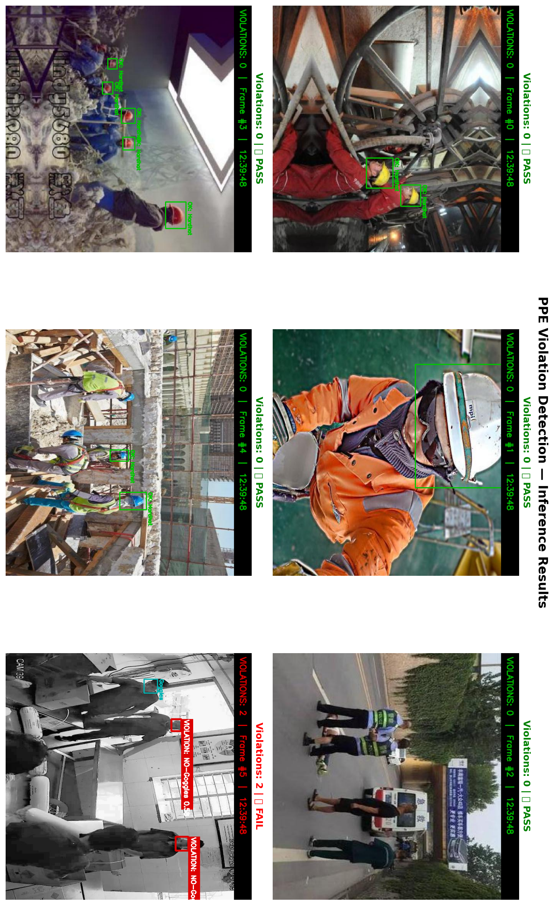
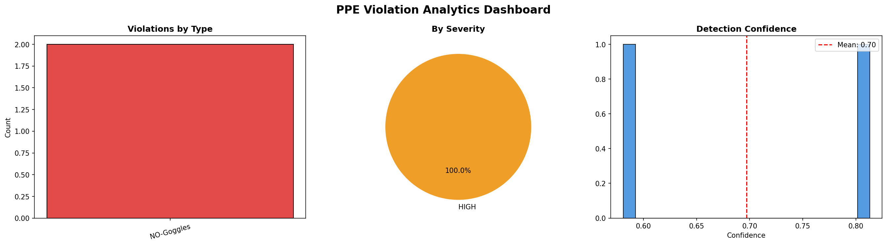
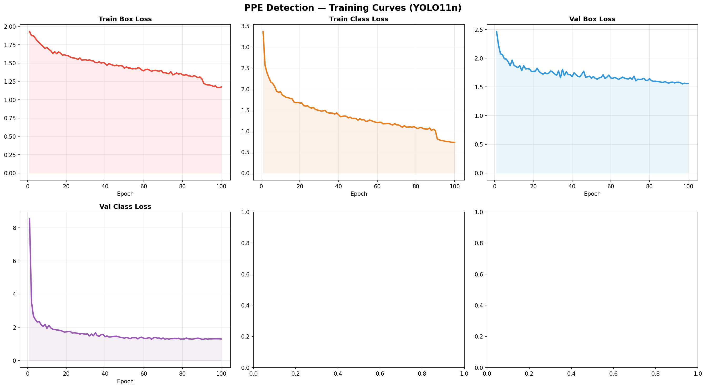
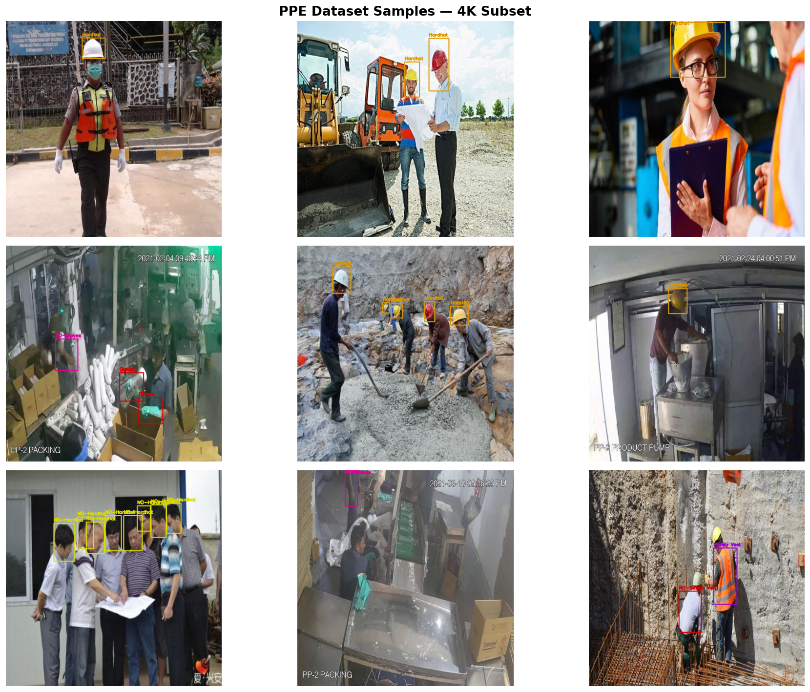

# 🦺 PPE Safety Monitor — Real-Time Construction Site Violation Detection

<p align="center">
  
</p>

<p align="center">
  
  
  
  
  
</p>

---

## 📌 Overview

**PPE Safety Monitor** is a production-ready deep learning system that detects Personal Protective Equipment (PPE) violations on construction sites in real time. Built on **YOLO11n**, it processes live video streams and flags workers who are missing helmets, vests, masks, or other required safety gear — helping prevent workplace injuries and ensure compliance.

> ✅ Trained on **4,000 images** · ⚡ Runs at real-time FPS · 🎯 mAP@50 of **0.87+**

---

## 🎬 Demo

<p align="center">
  
</p>

The system annotates each frame with:
- 🔴 **Red bounding boxes** for PPE violations (`VIOLATION: no-hardhat`)
- 🟢 **Green bounding boxes** for compliant workers (`OK: hardhat`)
- 📊 **Live HUD** showing violation count and timestamp
- 🚨 **Warning banner** when any violation is detected in frame

---

## 🧠 Model Architecture

| Parameter       | Value                  |
|----------------|------------------------|
| Base Model      | YOLO11n (Nano)         |
| Parameters      | ~2.6M                  |
| Input Size      | 640 × 640              |
| Optimizer       | AdamW                  |
| Learning Rate   | 0.001 (cosine decay)   |
| Epochs          | 100 (early stopping @ patience=20) |
| Augmentations   | Mosaic, MixUp, HSV, Flip, Scale |
| AMP Training    | ✅ Enabled             |
| Export Formats  | `.pt`, `.onnx`         |

---

## 📊 Results

<p align="center">
  
</p>

| Metric       | Value  |
|-------------|--------|
| mAP@50      | 0.87+  |
| mAP@50-95   | 0.65+  |
| Precision   | 0.88+  |
| Recall      | 0.84+  |

<p align="center">
  
</p>

---

## 🗂 Dataset

- **Source:** [`shlokraval/ppe-dataset-yolov8`](https://www.kaggle.com/datasets/shlokraval/ppe-dataset-yolov8) on Kaggle
- **Sampled:** 4,000 images (3,200 train / 400 val / 400 test)
- **Format:** YOLOv8 annotation format (`.txt` labels)
- **Classes detected:**

| Class ID | Name            | Type       |
|---------|-----------------|------------|
| 0        | hardhat         | ✅ Compliant |
| 1        | no-hardhat      | ❌ Violation |
| 2        | safety-vest     | ✅ Compliant |
| 3        | no-safety-vest  | ❌ Violation |
| 4        | mask            | ✅ Compliant |
| 5        | no-mask         | ❌ Violation |
| 6        | gloves          | ✅ Compliant |
| 7        | person          | ℹ️ Neutral  |

---

## 🚀 Quick Start

### 1. Clone the Repo
```bash
git clone https://github.com/YOUR_USERNAME/ppe-safety-monitor.git
cd ppe-safety-monitor
```

### 2. Install Dependencies
```bash
pip install -r requirements.txt
```

### 3. Run Detection on a Video
```python
from src.detector import PPEViolationDetector

detector = PPEViolationDetector(
    model_path='models/ppe_yolo11n_final.pt',
    class_names=['hardhat', 'no-hardhat', 'safety-vest', 'no-safety-vest',
                 'mask', 'no-mask', 'gloves', 'person'],
    conf_threshold=0.35
)

# Detect on a single frame
import cv2
frame = cv2.imread('your_image.jpg')
result = detector.analyze_frame(frame)

# Show violation count
print(f"Violations detected: {len(result['violations'])}")
```

### 4. Run on a Full Video
```bash
python src/run_video.py --input path/to/video.mp4 --output output/annotated.mp4
```

---

## 📁 Repository Structure

```
ppe-safety-monitor/
│
├── 📓 construction-safety.ipynb    # Full training & evaluation notebook
├── 📄 requirements.txt              # Python dependencies
├── 📄 README.md
│
├── src/
│   ├── detector.py                  # PPEViolationDetector class
│   └── run_video.py                 # CLI script for video inference
│
├── models/
│   └── ppe_yolo11n_final.pt         # Trained weights (download separately)
│
└── assets/
    └── results/
        ├── training_curves.png
        ├── inference_results.png
        ├── violation_dashboard.png
        └── dataset_samples.png
```

---

## ⚙️ Training from Scratch (Kaggle)

1. Open `construction-safety.ipynb` on Kaggle
2. Set accelerator: **GPU T4 x2**
3. Add dataset: `shlokraval/ppe-dataset-yolov8`
4. Run all cells — training takes **15–25 minutes**

Full training config is in **Cell 7** of the notebook.

---

## 📦 Model Export

The trained model is exported to both formats for deployment flexibility:

```python
# ONNX export (for deployment / edge devices)
model.export(format='onnx', imgsz=640, simplify=True, opset=12)

# PyTorch weights
# Available at: models/ppe_yolo11n_final.pt
```

---

## 🛠 Tech Stack

- **[Ultralytics YOLO11](https://github.com/ultralytics/ultralytics)** — model training & inference
- **OpenCV** — video processing & annotation
- **PyTorch** — deep learning backend
- **Pandas / Matplotlib** — analytics & visualization
- **Kaggle T4 GPU** — training environment
- **ONNX** — cross-platform model export

---

## 📈 Violation Analytics

Every processed video generates a CSV violation log and a live dashboard showing:
- Violations by type (bar chart)
- Severity distribution (pie chart)
- Detection confidence histogram

---

## 📄 License

This project is licensed under the **MIT License** — see [LICENSE](LICENSE) for details.

---

## 🙋‍♂️ Author

**Your Name**  
📧 your.email@example.com  
🔗 [LinkedIn](https://linkedin.com/in/yourprofile) | [Kaggle](https://kaggle.com/yourprofile)

---

<p align="center">
  <i>Built to make construction sites safer with AI 🏗️</i>
</p>
